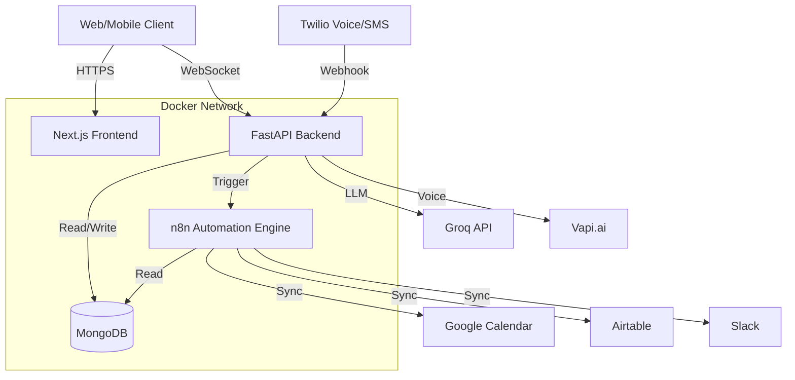

# 👨‍💻 CallFlow AI - Developer Documentation

## 🏗️ Architecture Overview

## 🔑 Environment Variables

### Backend (`backend/.env`)
| Variable | Description |
|----------|-------------|
| `MONGO_URI` | Connection string for MongoDB |
| `SECRET_KEY` | Key for encrypting API keys (Fernet) |
| `JWT_SECRET_KEY` | Key for signing JWT auth tokens |
| `TWILIO_*` | Twilio credentials for voice/SMS |
| `RESEND_API_KEY` | For sending welcome emails |
| `N8N_API_KEY` | Master key to control n8n workflows |

### Frontend (`frontend_next/.env.local`)
| Variable | Description |
|----------|-------------|
| `NEXT_PUBLIC_API_URL` | URL of the FastAPI backend |
| `NEXT_PUBLIC_STRIPE_KEY` | Stripe public key for payments |

## 🗄️ Database Collections (MongoDB)

- **`users`**: Auth credentials, role (`super_admin`, `admin`, `user`), `tenant_id`.
- **`tenants`**: Business profiles, subscription plan (`basic`, `pro`, `enterprise`).
- **`business_config`**: **Encrypted** API keys (`vapi`, `openai`, `twilio`, etc.) & automation toggles.
- **`appointments`**: Booked slots linked to `tenant_id`.
- **`conversations`**: Call logs, transcripts, and metadata.
- **`services`**: List of services offered by the business (e.g., "Haircut").

## 🔐 API Key Management Flow

1. **Storage**: Client API keys (e.g., their OpenAI key) are **never** stored in plain text.
2. **Encryption**: We use `Fernet` symmetric encryption (key derived from `SECRET_KEY`).
3. **Usage**: Keys are decrypted on-the-fly *only* when needed (e.g., making a call to Vapi).
4. **n8n**: Keys are injected securely into n8n credentials during workflow deployment.

## ⚡ n8n Automation Integration

- **Instance**: Single multi-tenant n8n instance running in Docker.
- **Workflows**: Created dynamically via API. Naming convention: `tenant_{id}_smart_automations`.
- **Isolation**: Each tenant gets their own isolated workflow.
- **Triggers**: Webhooks from Backend (`/api/v1/automations/trigger`) start the workflows.
