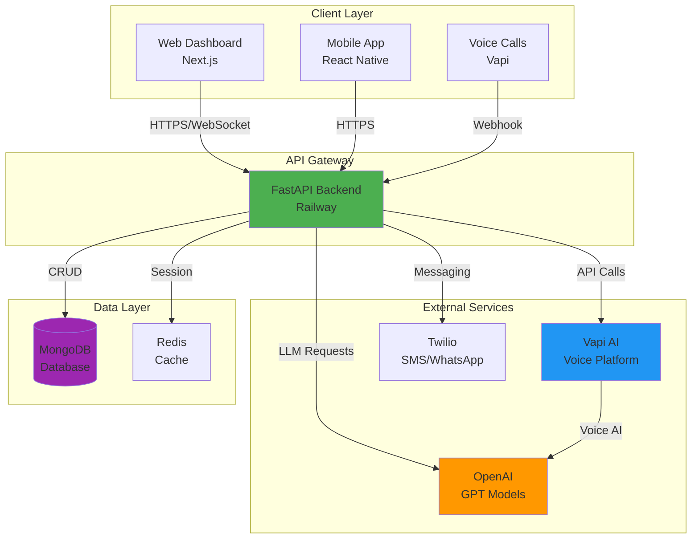
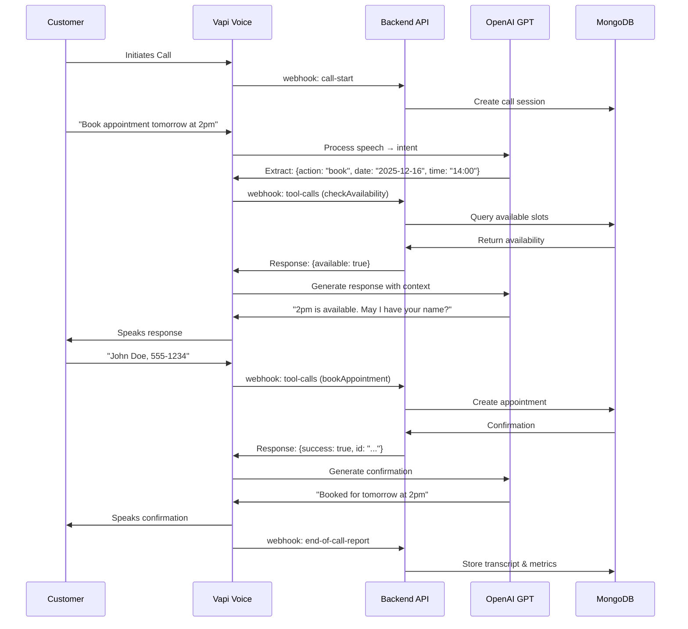
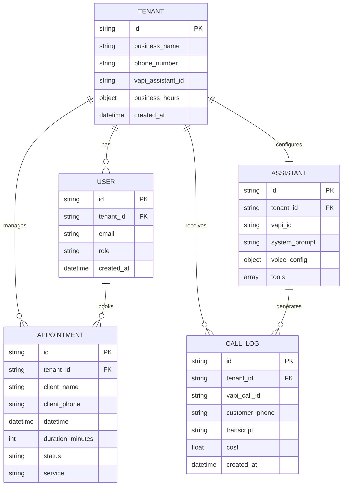
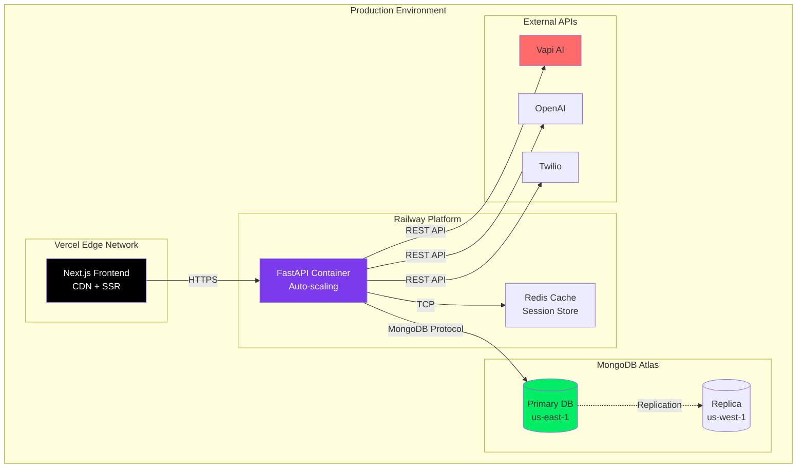
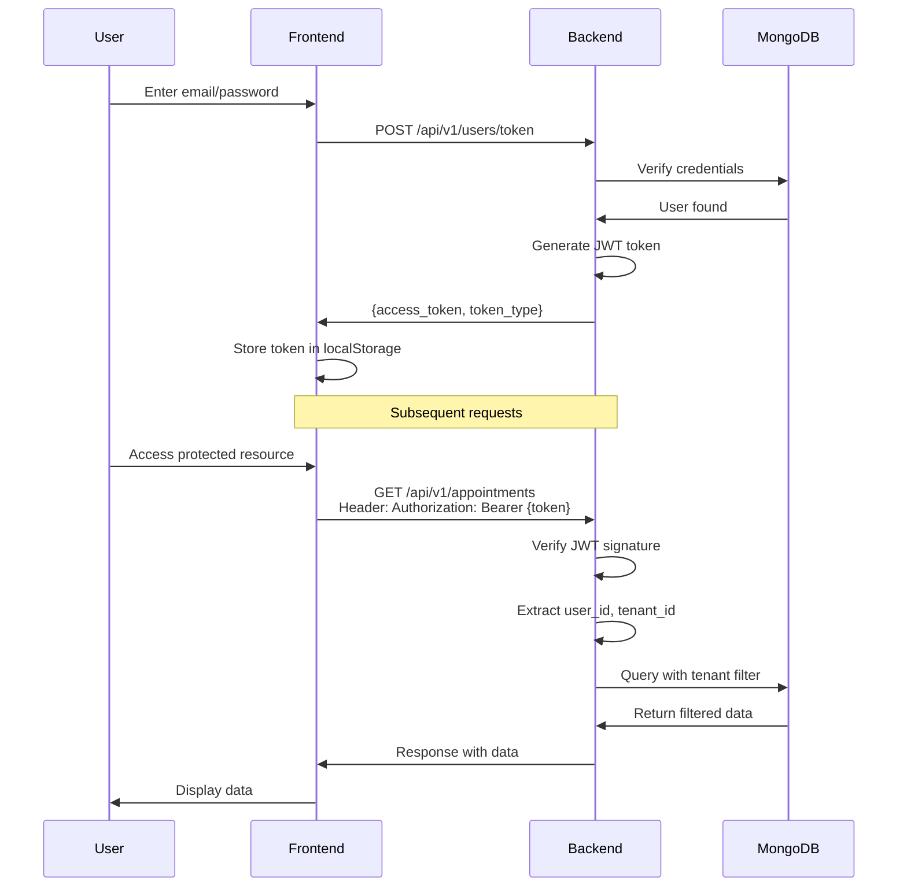
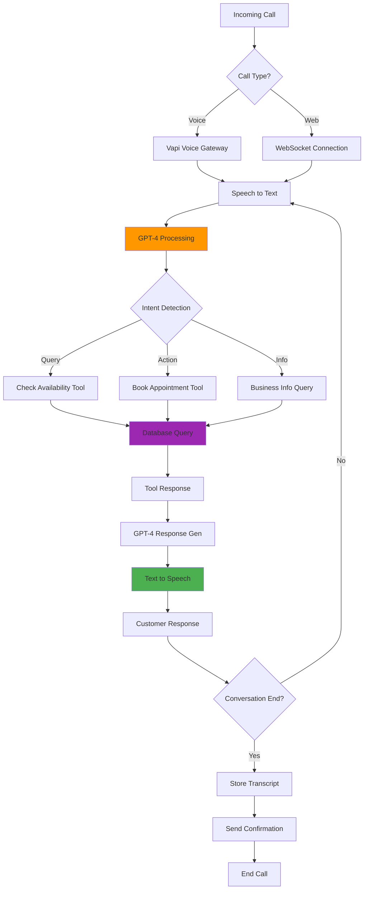

# AI Receptionist - Intelligent Voice & Chat Assistant Platform

<div align="center">


**An enterprise-grade AI-powered receptionist platform for automating customer calls, appointments, and business communications.**

[Features](#features) • [Architecture](#architecture) • [Setup](#setup) • [API Docs](#api-documentation) • [Deployment](#deployment)

</div>

---

## 📋 Table of Contents

- [Overview](#overview)
- [Features](#features)
- [Architecture](#architecture)
- [Tech Stack](#tech-stack)
- [System Diagrams](#system-diagrams)
- [Installation](#installation)
- [Configuration](#configuration)
- [API Documentation](#api-documentation)
- [Deployment](#deployment)
- [Testing](#testing)

---

## 🌟 Overview

AI Receptionist is a comprehensive SaaS platform that enables businesses to automate their customer service operations using AI-powered voice and chat assistants. The platform integrates with Vapi.ai for voice capabilities, MongoDB for data persistence, and provides a modern web dashboard for management.

### Key Capabilities

- 🤖 **AI Voice Assistant**: Natural language voice conversations powered by OpenAI GPT models
- 📅 **Appointment Management**: Automated scheduling with availability checking
- 💬 **Multi-Channel Support**: Voice calls, web chat, and WhatsApp integration
- 🏢 **Multi-Tenant**: Support for multiple businesses with isolated data
- 📊 **Analytics Dashboard**: Real-time insights and call transcripts
- 🔐 **Secure Authentication**: JWT-based auth with role-based access control
- 🌐 **RESTful API**: Comprehensive API for integrations

---

## ✨ Features

### For Business Owners
- **Dashboard Management**: Configure AI assistants, manage appointments, view analytics
- **Custom Branding**: White-label solution with custom voice, prompts, and branding
- **Call Logs**: Full transcripts and recordings of all conversations
- **Business Hours**: Configurable operating hours and timezone support
- **Service Management**: Define and manage service offerings

### For Customers
- **Natural Conversations**: Speak naturally to book appointments or get information
- **24/7 Availability**: AI assistant available round the clock
- **Multi-Language**: Support for multiple languages (configurable)
- **SMS/Email Confirmations**: Automated booking confirmations
- **Self-Service**: Check availability and book without human intervention

### For Developers
- **REST API**: Full-featured API for integrations
- **Webhooks**: Real-time event notifications
- **Custom Tools**: Extend AI capabilities with custom functions
- **SDK Support**: Client libraries for popular languages

---

## 🏗️ Architecture

### High-Level System Architecture



### Request Flow Diagram



### Data Model



### Component Breakdown

```mermaid
graph LR
    subgraph "Backend Services"
        A[Appointments Service]
        B[Assistant Service]
        C[User Service]
        D[Vapi Service]
        E[Provisioning Service]
    end
    
    subgraph "API Routers"
        F[/appointments]
        G[/assistant]
        H[/users]
        I[/vapi/webhook]
        J[/websocket]
    end
    
    subgraph "Middleware"
        K[CORS]
        L[Auth JWT]
        M[Error Handler]
        N[Rate Limiter]
    end
    
    F --> A
    G --> B
    H --> C
    I --> D
    J --> E
    
    K --> F
    K --> G
    K --> H
    K --> I
    L --> F
    L --> G
    L --> H
    M --> L
    N --> K
    
    style A fill:#4CAF50
    style B fill:#2196F3
    style C fill:#FF9800
    style D fill:#9C27B0
```

---

## 🛠️ Tech Stack

### Backend
- **FastAPI** (0.115+): Modern Python web framework
- **Python** (3.11+): Core programming language
- **MongoDB**: NoSQL database for scalable data storage
- **Pydantic**: Data validation and settings management
- **PyJWT**: JSON Web Token authentication
- **Motor**: Async MongoDB driver

### Frontend
- **Next.js** (16.0): React framework with SSR
- **TypeScript**: Type-safe JavaScript
- **Tailwind CSS**: Utility-first CSS framework
- **shadcn/ui**: Component library
- **React Query**: Server state management
- **Socket.io**: Real-time communication

### External Services
- **Vapi.ai**: Voice AI platform
- **OpenAI**: GPT-4 language models
- **Twilio**: SMS and WhatsApp messaging (optional)
- **Stripe**: Payment processing (optional)

### DevOps & Infrastructure
- **Railway**: Backend deployment
- **Vercel**: Frontend deployment
- **Docker**: Containerization
- **GitHub Actions**: CI/CD pipelines
- **MongoDB Atlas**: Cloud database

---

## 📊 System Diagrams

### Deployment Architecture



### Authentication Flow



### Call Processing Pipeline



---

## 🚀 Installation

### Prerequisites
- Python 3.11+
- Node.js 18+
- MongoDB 5.0+
- Redis (optional, for caching)
- Vapi.ai account
- OpenAI API key

### Backend Setup

```bash
# Clone repository
git clone https://github.com/montaassarr/ai-_receptionist.git
cd ai_receptionist/backend

# Create virtual environment
python -m venv venv
source venv/bin/activate  # On Windows: venv\Scripts\activate

# Install dependencies
pip install -r requirements.txt

# Configure environment
cp .env.example .env
# Edit .env with your credentials

# Run database migrations (if any)
python scripts/init_db.py

# Start development server
uvicorn main:app --reload --port 8000
```

### Frontend Setup

```bash
cd frontend_next

# Install dependencies
npm install

# Configure environment
cp .env.example .env.local
# Edit .env.local with API URL

# Start development server
npm run dev
```

### Docker Setup

```bash
# Build and run all services
docker-compose up -d

# View logs
docker-compose logs -f

# Stop services
docker-compose down
```

---

## ⚙️ Configuration

### Environment Variables

#### Backend (.env)
```bash
# Application
APP_NAME="AI Receptionist"
ENVIRONMENT="production"
DEBUG=false

# Database
MONGO_URI="mongodb://localhost:27017/ai_receptionist"
MONGO_DB_NAME="ai_receptionist"

# Security
SECRET_KEY="your-secret-key-min-32-chars"
ALGORITHM="HS256"
ACCESS_TOKEN_EXPIRE_MINUTES=1440

# Vapi Configuration
VAPI_PRIVATE_API_KEY="your-vapi-private-key"
VAPI_PUBLIC_KEY="your-vapi-public-key"
VAPI_WEBHOOK_SECRET="your-webhook-secret"
VAPI_WEBHOOK_URL="https://your-domain.com/api/v1/vapi/webhook"
VAPI_ORGANIZATION_ID="your-org-id"

# OpenAI (optional, for custom integrations)
OPENAI_API_KEY="your-openai-key"

# CORS Origins
CORS_ORIGINS="http://localhost:3000,https://your-frontend-domain.com"

# Timezone
TIMEZONE="America/New_York"
```

#### Frontend (.env.local)
```bash
NEXT_PUBLIC_API_URL=http://localhost:8000/api/v1
NEXT_PUBLIC_WS_URL=ws://localhost:8000/ws
NEXT_PUBLIC_VAPI_PUBLIC_KEY=your-vapi-public-key
```

---

## 📚 API Documentation

### Authentication

All protected endpoints require JWT authentication:

```http
Authorization: Bearer <your_jwt_token>
```

### Core Endpoints

#### Authentication
```http
POST /api/v1/users/token
POST /api/v1/users/register
GET  /api/v1/users/me
```

#### Appointments
```http
GET    /api/v1/appointments
POST   /api/v1/appointments
GET    /api/v1/appointments/{id}
PATCH  /api/v1/appointments/{id}
DELETE /api/v1/appointments/{id}
```

#### Assistant Management
```http
GET   /api/v1/assistant/me
PATCH /api/v1/assistant/me
POST  /api/v1/assistant/me/tools/{tool_name}/enable
POST  /api/v1/assistant/me/tools/{tool_name}/disable
```

#### Vapi Webhooks
```http
POST /api/v1/vapi/webhook
POST /api/v1/vapi/webhook/{tenant_id}
```

### Example Requests

#### Create Appointment
```bash
curl -X POST "http://localhost:8000/api/v1/appointments" \
  -H "Authorization: Bearer YOUR_TOKEN" \
  -H "Content-Type: application/json" \
  -d '{
    "client_name": "John Doe",
    "client_phone": "+1234567890",
    "service": "Consultation",
    "datetime": "2025-12-16T14:00:00",
    "duration_minutes": 30
  }'
```

#### Check Availability
```bash
curl -X GET "http://localhost:8000/api/v1/appointments/availability?date=2025-12-16&time=14:00" \
  -H "Authorization: Bearer YOUR_TOKEN"
```

### Interactive API Docs

Access comprehensive API documentation at:
- Swagger UI: `http://localhost:8000/docs`
- ReDoc: `http://localhost:8000/redoc`

---

## 🚀 Deployment

### Railway (Backend)

1. **Connect Repository**
   ```bash
   # Install Railway CLI
   npm install -g @railway/cli
   
   # Login and link project
   railway login
   railway link
   ```

2. **Configure Environment**
   - Add all environment variables in Railway dashboard
   - Set `Dockerfile.railway` as the build file

3. **Deploy**
   ```bash
   railway up
   ```

### Vercel (Frontend)

1. **Connect Repository**
   - Import project from GitHub in Vercel dashboard
   - Select `frontend_next` as root directory

2. **Configure Environment**
   - Add environment variables in Vercel settings
   - Set `NEXT_PUBLIC_API_URL` to Railway backend URL

3. **Deploy**
   - Automatic deployment on push to main branch

### MongoDB Atlas

1. Create cluster on MongoDB Atlas
2. Whitelist Railway IP addresses
3. Update `MONGO_URI` in environment variables

### Vapi Configuration

1. Create organization on Vapi.ai
2. Set webhook URL to: `https://your-railway-url.up.railway.app/api/v1/vapi/webhook`
3. Copy API keys to environment variables
4. Create tools in Vapi dashboard (or via API)

---

## 🧪 Testing

### Backend Tests

```bash
cd backend

# Run all tests
pytest

# Run with coverage
pytest --cov=. --cov-report=html

# Run specific test file
pytest tests/test_appointments.py

# Run integration tests
pytest tests/integration/
```

### Frontend Tests

```bash
cd frontend_next

# Run unit tests
npm test

# Run E2E tests
npm run test:e2e

# Run with coverage
npm run test:coverage
```

### Manual Testing

```bash
# Test production endpoints
bash scripts/test_production.sh

# Test webhook integration
python scripts/test_endpoints.py
```

---

## 📝 Project Structure

```
ai_receptionist/
├── backend/
│   ├── main.py                 # FastAPI application entry
│   ├── requirements.txt        # Python dependencies
│   ├── Dockerfile             # Docker configuration
│   ├── data/                  # Seed data
│   ├── database/              # MongoDB configuration
│   ├── middleware/            # Custom middleware
│   ├── models/                # Pydantic models
│   │   ├── appointment.py
│   │   ├── user.py
│   │   ├── tenant.py
│   │   └── agent.py
│   ├── routers/               # API endpoints
│   │   ├── appointments.py
│   │   ├── users.py
│   │   ├── assistant.py
│   │   └── vapi.py
│   ├── services/              # Business logic
│   │   ├── appointments_service.py
│   │   ├── assistant_service.py
│   │   ├── vapi_service.py
│   │   └── provisioning.py
│   ├── utils/                 # Utilities
│   │   ├── config.py
│   │   ├── datetime_utils.py
│   │   └── auth.py
│   └── tests/                 # Test suites
│
├── frontend_next/
│   ├── app/                   # Next.js 16 app directory
│   │   ├── layout.tsx
│   │   ├── page.tsx
│   │   ├── dashboard/
│   │   ├── appointments/
│   │   └── settings/
│   ├── components/            # React components
│   │   ├── ui/               # shadcn components
│   │   ├── appointments/
│   │   └── dashboard/
│   ├── lib/                   # Utilities
│   │   ├── api.ts
│   │   └── utils.ts
│   ├── hooks/                 # Custom hooks
│   ├── contexts/              # React contexts
│   └── public/                # Static assets
│
├── docs/                      # Documentation
├── scripts/                   # Utility scripts
├── k8s/                       # Kubernetes manifests
├── docker-compose.yml         # Docker compose config
└── README.md                  # This file
```

---

## 🤝 Contributing

We welcome contributions! Please follow these guidelines:

1. **Fork the repository**
2. **Create a feature branch**: `git checkout -b feature/amazing-feature`
3. **Commit changes**: `git commit -m 'Add amazing feature'`
4. **Push to branch**: `git push origin feature/amazing-feature`
5. **Open a Pull Request**

### Code Style
- Backend: Follow PEP 8 (enforced by `black` and `flake8`)
- Frontend: Follow Airbnb style guide (enforced by ESLint)

### Commit Messages
Follow conventional commits:
```
feat: add new feature
fix: resolve bug
docs: update documentation
test: add tests
refactor: code restructuring
```

---

## 📄 License

This project is licensed under the MIT License - see the [LICENSE](LICENSE) file for details.

---

## 🙏 Acknowledgments

- [Vapi.ai](https://vapi.ai) for voice AI infrastructure
- [OpenAI](https://openai.com) for GPT models
- [FastAPI](https://fastapi.tiangolo.com/) for the excellent framework
- [Next.js](https://nextjs.org/) team for the frontend framework
- All contributors and supporters

---

<div align="center">

**Made with ❤️ by the AI Receptionist Team**

**Production URLs:**
- Backend API: [https://ai-receptionist-production-299a.up.railway.app](https://ai-receptionist-production-299a.up.railway.app)
- Frontend Dashboard: [https://aireceptionist-lake.vercel.app](https://aireceptionist-lake.vercel.app)
- API Docs: [https://ai-receptionist-production-299a.up.railway.app/docs](https://ai-receptionist-production-299a.up.railway.app/docs)

</div>

