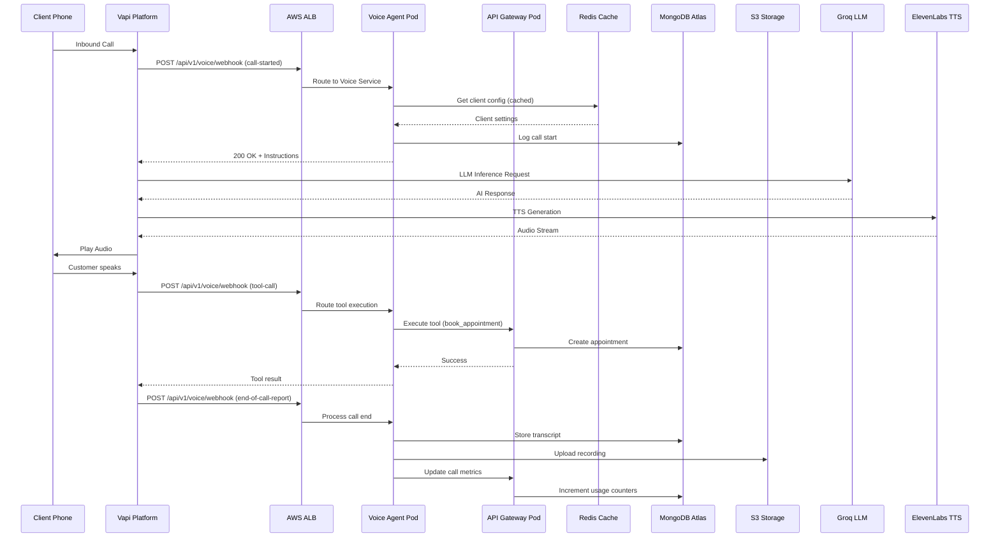

# Production Architecture Blueprint - AI Receptionist SaaS

> **Multi-Tenant, Cloud-Native, Kubernetes-Orchestrated AI Voice & WhatsApp Platform**  
> Last Updated: November 20, 2025

---

## Table of Contents

1. [System Overview](#system-overview)
2. [Architecture Diagram](#architecture-diagram)
3. [Component Breakdown](#component-breakdown)
4. [AWS Infrastructure](#aws-infrastructure)
5. [Kubernetes Architecture](#kubernetes-architecture)
6. [Multi-Tenant Design](#multi-tenant-design)
7. [Security Architecture](#security-architecture)
8. [Scaling Strategy](#scaling-strategy)
9. [Cost Optimization](#cost-optimization)
10. [Disaster Recovery](#disaster-recovery)

---

## System Overview

### High-Level Architecture

```
┌─────────────────────────────────────────────────────────────────────────────┐
│                          GLOBAL EDGE LAYER                                   │
│  ┌──────────────┐    ┌──────────────┐    ┌──────────────┐                  │
│  │ CloudFront   │    │ Route 53     │    │ WAF          │                  │
│  │ CDN          │    │ DNS          │    │ DDoS         │                  │
│  └──────────────┘    └──────────────┘    └──────────────┘                  │
└─────────────────────────────────────────────────────────────────────────────┘
                                    │
                                    ▼
┌─────────────────────────────────────────────────────────────────────────────┐
│                      APPLICATION LOAD BALANCER                               │
│  ┌─────────────────────────────────────────────────────────────┐            │
│  │  ALB + SSL Termination + Health Checks + Target Groups     │            │
│  └─────────────────────────────────────────────────────────────┘            │
└─────────────────────────────────────────────────────────────────────────────┘
                                    │
                    ┌───────────────┴───────────────┐
                    ▼                               ▼
┌─────────────────────────────────┐  ┌─────────────────────────────────┐
│    EKS CLUSTER (us-east-1)      │  │   EKS CLUSTER (eu-west-1)       │
│                                 │  │                                 │
│  ┌───────────────────────────┐  │  │  ┌───────────────────────────┐  │
│  │  NAMESPACE: production    │  │  │  │  NAMESPACE: production    │  │
│  │                           │  │  │  │                           │  │
│  │  ┌─────────────────────┐  │  │  │  │  ┌─────────────────────┐  │  │
│  │  │ API Gateway Service │  │  │  │  │  │ API Gateway Service │  │  │
│  │  │ (FastAPI)           │  │  │  │  │  │ (FastAPI)           │  │  │
│  │  │ Replicas: 3-10      │  │  │  │  │  │ Replicas: 3-10      │  │  │
│  │  └─────────────────────┘  │  │  │  │  └─────────────────────┘  │  │
│  │                           │  │  │  │                           │  │
│  │  ┌─────────────────────┐  │  │  │  │  ┌─────────────────────┐  │  │
│  │  │ Voice Agent Service │  │  │  │  │  │ Voice Agent Service │  │  │
│  │  │ (Vapi Integration)  │  │  │  │  │  │ (Vapi Integration)  │  │  │
│  │  │ Replicas: 5-20      │  │  │  │  │  │ Replicas: 5-20      │  │  │
│  │  └─────────────────────┘  │  │  │  │  └─────────────────────┘  │  │
│  │                           │  │  │  │                           │  │
│  │  ┌─────────────────────┐  │  │  │  │  ┌─────────────────────┐  │  │
│  │  │ WhatsApp Service    │  │  │  │  │  │ WhatsApp Service    │  │  │
│  │  │ (Meta Cloud API)    │  │  │  │  │  │ (Meta Cloud API)    │  │  │
│  │  │ Replicas: 2-8       │  │  │  │  │  │ Replicas: 2-8       │  │  │
│  │  └─────────────────────┘  │  │  │  │  └─────────────────────┘  │  │
│  │                           │  │  │  │                           │  │
│  │  ┌─────────────────────┐  │  │  │  │  ┌─────────────────────┐  │  │
│  │  │ Billing Service     │  │  │  │  │  │ Billing Service     │  │  │
│  │  │ (Stripe, Metering)  │  │  │  │  │  │ (Stripe, Metering)  │  │  │
│  │  │ Replicas: 2         │  │  │  │  │  │ Replicas: 2         │  │  │
│  │  └─────────────────────┘  │  │  │  │  └─────────────────────┘  │  │
│  │                           │  │  │  │                           │  │
│  │  ┌─────────────────────┐  │  │  │  │  ┌─────────────────────┐  │  │
│  │  │ Analytics Service   │  │  │  │  │  │ Analytics Service   │  │  │
│  │  │ (Metrics, Reports)  │  │  │  │  │  │ (Metrics, Reports)  │  │  │
│  │  │ Replicas: 2-4       │  │  │  │  │  │ Replicas: 2-4       │  │  │
│  │  └─────────────────────┘  │  │  │  │  └─────────────────────┘  │  │
│  │                           │  │  │  │                           │  │
│  └───────────────────────────┘  │  │  └───────────────────────────┘  │
│                                 │  │                                 │
│  ┌───────────────────────────┐  │  │  ┌───────────────────────────┐  │
│  │  NAMESPACE: staging       │  │  │  │  NAMESPACE: staging       │  │
│  │  (Mirror of production)   │  │  │  │  (Mirror of production)   │  │
│  └───────────────────────────┘  │  │  └───────────────────────────┘  │
└─────────────────────────────────┘  └─────────────────────────────────┘
                    │                               │
                    └───────────────┬───────────────┘
                                    ▼
┌─────────────────────────────────────────────────────────────────────────────┐
│                           DATA LAYER                                         │
│                                                                              │
│  ┌──────────────────┐  ┌──────────────────┐  ┌──────────────────┐          │
│  │ MongoDB Atlas    │  │ Redis Cluster    │  │ S3 Buckets       │          │
│  │ (Multi-Region)   │  │ ElastiCache      │  │                  │          │
│  │                  │  │                  │  │ - Call Recordings│          │
│  │ - Clients        │  │ - Session Cache  │  │ - Transcripts    │          │
│  │ - Users          │  │ - Rate Limiting  │  │ - Assets         │          │
│  │ - Calls          │  │ - Job Queue      │  │ - Backups        │          │
│  │ - WhatsApp Msgs  │  │ - Config Cache   │  │                  │          │
│  │ - Subscriptions  │  │                  │  │                  │          │
│  │                  │  │                  │  │                  │          │
│  │ Sharded by:      │  │                  │  │                  │          │
│  │ client_id        │  │                  │  │                  │          │
│  └──────────────────┘  └──────────────────┘  └──────────────────┘          │
└─────────────────────────────────────────────────────────────────────────────┘
                                    │
                                    ▼
┌─────────────────────────────────────────────────────────────────────────────┐
│                      EXTERNAL SERVICES LAYER                                 │
│                                                                              │
│  ┌──────────────┐  ┌──────────────┐  ┌──────────────┐  ┌──────────────┐   │
│  │ Vapi         │  │ Meta Graph   │  │ Stripe       │  │ Twilio       │   │
│  │ Voice AI     │  │ WhatsApp API │  │ Payments     │  │ Phone Nos.   │   │
│  └──────────────┘  └──────────────┘  └──────────────┘  └──────────────┘   │
│                                                                              │
│  ┌──────────────┐  ┌──────────────┐  ┌──────────────┐  ┌──────────────┐   │
│  │ Groq         │  │ ElevenLabs   │  │ Sentry       │  │ Datadog      │   │
│  │ LLM          │  │ Voice TTS    │  │ Errors       │  │ APM          │   │
│  └──────────────┘  └──────────────┘  └──────────────┘  └──────────────┘   │
└─────────────────────────────────────────────────────────────────────────────┘
                                    │
                                    ▼
┌─────────────────────────────────────────────────────────────────────────────┐
│                      MONITORING & LOGGING                                    │
│                                                                              │
│  ┌──────────────────┐  ┌──────────────────┐  ┌──────────────────┐          │
│  │ CloudWatch       │  │ Prometheus       │  │ Grafana          │          │
│  │ Logs & Metrics   │  │ Cluster Metrics  │  │ Dashboards       │          │
│  └──────────────────┘  └──────────────────┘  └──────────────────┘          │
│                                                                              │
│  ┌──────────────────┐  ┌──────────────────┐  ┌──────────────────┐          │
│  │ ELK Stack        │  │ Jaeger           │  │ PagerDuty        │          │
│  │ Log Aggregation  │  │ Distributed      │  │ Alerting         │          │
│  │                  │  │ Tracing          │  │                  │          │
│  └──────────────────┘  └──────────────────┘  └──────────────────┘          │
└─────────────────────────────────────────────────────────────────────────────┘
                                    │
                                    ▼
┌─────────────────────────────────────────────────────────────────────────────┐
│                         CI/CD PIPELINE                                       │
│                                                                              │
│  ┌────────┐   ┌────────┐   ┌────────┐   ┌────────┐   ┌────────┐           │
│  │ GitHub │ → │ Actions│ → │ ECR    │ → │ ArgoCD │ → │ EKS    │           │
│  │ Repo   │   │ CI     │   │ Images │   │ Deploy │   │ Pods   │           │
│  └────────┘   └────────┘   └────────┘   └────────┘   └────────┘           │
│                                                                              │
│  Testing → Build → Push → Deploy → Verify → Rollback (if needed)           │
└─────────────────────────────────────────────────────────────────────────────┘
```

---

## Architecture Diagram

### Request Flow for Voice Call



### Multi-Tenant Isolation

```
┌─────────────────────────────────────────────────────────────────┐
│                         REQUEST ROUTER                          │
│                                                                 │
│  Extracts tenant_id from:                                      │
│  - JWT token (client_id claim)                                 │
│  - Subdomain (client1.yourdomain.com)                          │
│  - API key header (X-Client-ID)                                │
│  - Phone number mapping (DynamoDB lookup)                      │
└─────────────────────────────────────────────────────────────────┘
                             │
                             ▼
        ┌────────────────────┴────────────────────┐
        │                                         │
        ▼                                         ▼
┌─────────────────┐                     ┌─────────────────┐
│ CLIENT A        │                     │ CLIENT B        │
│ tenant_id: 123  │                     │ tenant_id: 456  │
│                 │                     │                 │
│ MongoDB Queries:│                     │ MongoDB Queries:│
│ {client_id:123} │                     │ {client_id:456} │
│                 │                     │                 │
│ Redis Keys:     │                     │ Redis Keys:     │
│ client:123:*    │                     │ client:456:*    │
│                 │                     │                 │
│ S3 Prefix:      │                     │ S3 Prefix:      │
│ clients/123/    │                     │ clients/456/    │
└─────────────────┘                     └─────────────────┘
```

---

## Component Breakdown

### 1. Frontend (React SPA)

**Hosting:** CloudFront + S3 Static Website

**Features:**
- Multi-language support (i18n)
- Per-client branding (white-label)
- Real-time dashboard updates (WebSockets)
- Mobile-responsive design

**Build Pipeline:**
```bash
npm run build → S3 sync → CloudFront invalidation
```

### 2. API Gateway Service (FastAPI)

**Purpose:** Central API orchestration, authentication, rate limiting

**Key Routes:**
- `/api/v1/auth/*` - Authentication endpoints
- `/api/v1/clients/*` - Client management
- `/api/v1/appointments/*` - Appointment CRUD
- `/api/v1/services/*` - Service catalog
- `/api/v1/analytics/*` - Reporting

**Scaling:**
- Horizontal Pod Autoscaler (HPA): 3-10 replicas
- CPU target: 70%
- Memory target: 80%

### 3. Voice Agent Service

**Purpose:** Vapi webhook handler, call orchestration, tool execution

**Key Routes:**
- `/api/v1/voice/webhook` - Vapi events
- `/api/v1/voice/call-history` - Call logs
- `/api/v1/voice/config` - Voice settings

**Scaling:**
- HPA: 5-20 replicas (high traffic during business hours)
- WebSocket connections: sticky sessions via ALB
- Call recording upload: async to SQS → Lambda → S3

### 4. WhatsApp Service

**Purpose:** Meta Cloud API integration, message processing

**Key Routes:**
- `/api/v1/whatsapp/webhook` - Meta webhooks
- `/api/v1/whatsapp/send` - Outbound messages

**Scaling:**
- HPA: 2-8 replicas
- Message queue: SQS for retry logic

### 5. Billing Service

**Purpose:** Stripe integration, usage metering, subscription management

**Key Routes:**
- `/api/v1/billing/subscribe` - Create subscription
- `/api/v1/billing/portal` - Customer portal
- `/api/v1/billing/usage` - Report usage

**Jobs:**
- Hourly: Aggregate usage metrics
- Daily: Generate invoices for overages
- Monthly: Process subscription renewals

### 6. Analytics Service

**Purpose:** Aggregate metrics, generate reports, ML insights

**Features:**
- Call sentiment analysis
- Conversion tracking
- Peak hour detection
- Anomaly detection

**Data Pipeline:**
```
MongoDB Change Streams → Kafka → Spark Streaming → Aggregated Tables
```

---

## AWS Infrastructure

### Compute

| Service | Use Case | Configuration |
|---------|----------|---------------|
| **EKS** | Kubernetes cluster | Multi-AZ, managed node groups, 3-30 nodes (t3.medium - t3.xlarge) |
| **EC2** | Bastion hosts, CI runners | t3.small, auto-scaling group |
| **Lambda** | Async tasks (recording upload, webhooks) | Python 3.11, 512MB-3GB memory |
| **Fargate** | Batch jobs (reports, exports) | Serverless containers |

### Networking

| Service | Use Case | Configuration |
|---------|----------|---------------|
| **VPC** | Private network | 10.0.0.0/16, 3 public + 3 private subnets across 3 AZs |
| **ALB** | Load balancing | SSL termination, health checks, target groups per service |
| **Route 53** | DNS management | Hosted zones, geo-routing, health checks |
| **CloudFront** | CDN | Global edge locations, custom SSL certificates |
| **API Gateway** | REST API proxy | Rate limiting, API keys, request/response transformation |

### Storage

| Service | Use Case | Configuration |
|---------|----------|---------------|
| **S3** | Call recordings, backups, static assets | Standard, Intelligent-Tiering, lifecycle policies |
| **EBS** | Persistent volumes (K8s) | gp3, encrypted, automated snapshots |
| **EFS** | Shared storage (if needed) | Provisioned throughput |

### Database

| Service | Use Case | Configuration |
|---------|----------|---------------|
| **MongoDB Atlas** | Primary database | M30+ cluster, sharded by client_id, multi-region replicas |
| **ElastiCache (Redis)** | Caching, sessions, queues | Cluster mode, 3 nodes, automatic failover |
| **DynamoDB** | Phone number → client mapping | On-demand pricing, global tables |

### Security

| Service | Use Case | Configuration |
|---------|----------|---------------|
| **IAM** | Access control | Roles for pods (IRSA), least privilege policies |
| **Secrets Manager** | API keys, credentials | Automatic rotation, encryption at rest |
| **KMS** | Encryption keys | Customer-managed keys for S3, EBS, RDS |
| **WAF** | Web application firewall | Rate limiting, geo-blocking, SQL injection protection |
| **Shield** | DDoS protection | Standard (free) or Advanced ($3k/month) |

### Monitoring

| Service | Use Case | Configuration |
|---------|----------|---------------|
| **CloudWatch** | Logs, metrics, alarms | Log groups per service, metric filters, SNS alerts |
| **CloudTrail** | Audit logging | All API calls logged, S3 archive |
| **X-Ray** | Distributed tracing | Trace API requests across services |

### CI/CD

| Service | Use Case | Configuration |
|---------|----------|---------------|
| **ECR** | Docker registry | Private repos per service, image scanning |
| **CodeBuild** | Build service | Backup to GitHub Actions |
| **CodePipeline** | Deployment pipeline | Optional, prefer ArgoCD for K8s |

---

## Kubernetes Architecture

### Cluster Configuration (EKS)

```yaml
# eksctl config
apiVersion: eksctl.io/v1alpha5
kind: ClusterConfig

metadata:
  name: ai-receptionist-prod
  region: us-east-1
  version: "1.28"

vpc:
  cidr: 10.0.0.0/16
  nat:
    gateway: HighlyAvailable

iam:
  withOIDC: true
  serviceAccounts:
    - metadata:
        name: aws-load-balancer-controller
        namespace: kube-system
      wellKnownPolicies:
        awsLoadBalancerController: true
    - metadata:
        name: ebs-csi-controller
        namespace: kube-system
      wellKnownPolicies:
        ebsCSIController: true

managedNodeGroups:
  - name: general-purpose
    instanceType: t3.medium
    minSize: 3
    maxSize: 10
    desiredCapacity: 3
    volumeSize: 50
    labels:
      role: general
    tags:
      nodegroup-role: general
    iam:
      withAddonPolicies:
        autoScaler: true
        cloudWatch: true
        ebs: true

  - name: voice-agents
    instanceType: c5.xlarge
    minSize: 2
    maxSize: 20
    desiredCapacity: 5
    volumeSize: 100
    labels:
      role: voice-agent
    taints:
      - key: voice-agent
        value: "true"
        effect: NoSchedule
    tags:
      nodegroup-role: voice-agent
```

### Namespace Strategy

```yaml
# production namespace
apiVersion: v1
kind: Namespace
metadata:
  name: production
  labels:
    environment: production
    istio-injection: enabled

---
# staging namespace
apiVersion: v1
kind: Namespace
metadata:
  name: staging
  labels:
    environment: staging
    istio-injection: enabled

---
# monitoring namespace
apiVersion: v1
kind: Namespace
metadata:
  name: monitoring
  labels:
    environment: shared
```

### Service Mesh (Istio)

**Benefits:**
- Mutual TLS between services
- Traffic management (canary deployments)
- Observability (distributed tracing)
- Circuit breaking, retries, timeouts

**Components:**
- Istio Control Plane
- Envoy sidecars (auto-injected)
- Kiali dashboard
- Jaeger tracing

### Ingress Controller

**AWS Load Balancer Controller:**
- Creates ALB automatically from Ingress resources
- SSL termination at ALB
- Path-based routing
- Health checks

```yaml
apiVersion: networking.k8s.io/v1
kind: Ingress
metadata:
  name: api-ingress
  namespace: production
  annotations:
    alb.ingress.kubernetes.io/scheme: internet-facing
    alb.ingress.kubernetes.io/target-type: ip
    alb.ingress.kubernetes.io/certificate-arn: arn:aws:acm:...
    alb.ingress.kubernetes.io/listen-ports: '[{"HTTP": 80}, {"HTTPS": 443}]'
    alb.ingress.kubernetes.io/ssl-redirect: '443'
spec:
  ingressClassName: alb
  rules:
    - host: api.yourdomain.com
      http:
        paths:
          - path: /api/v1/voice
            pathType: Prefix
            backend:
              service:
                name: voice-agent-service
                port:
                  number: 8001
          - path: /api/v1/whatsapp
            pathType: Prefix
            backend:
              service:
                name: whatsapp-service
                port:
                  number: 8002
          - path: /
            pathType: Prefix
            backend:
              service:
                name: api-gateway-service
                port:
                  number: 8000
```

---

## Multi-Tenant Design

### Tenant Isolation Strategy

**Level 1: Shared Infrastructure, Isolated Data**
- All clients use same K8s cluster
- Data isolated by `client_id` in MongoDB queries
- Redis keys prefixed with `client:{client_id}:`
- S3 objects prefixed with `clients/{client_id}/`

**Level 2: Per-Tenant Subdomain**
- `client1.yourdomain.com` → same backend, different branding
- CloudFront distribution per subdomain (optional)
- Nginx ingress routes based on subdomain

**Level 3: Enterprise Tier (Optional)**
- Dedicated K8s namespace per enterprise client
- Dedicated MongoDB shard
- Dedicated node pool with taints

### Client Identification Methods

1. **JWT Token** (Dashboard users):
   ```json
   {
     "sub": "user_id",
     "client_id": "123",
     "role": "admin",
     "exp": 1700000000
   }
   ```

2. **API Key** (Third-party integrations):
   ```
   X-API-Key: sk_live_abc123def456
   → Lookup client_id in DynamoDB
   ```

3. **Phone Number** (Vapi webhooks):
   ```
   Incoming call from +15551234567
   → DynamoDB: phone_number → client_id
   ```

4. **WhatsApp Number** (Meta webhooks):
   ```
   Message to business account 123456789
   → DynamoDB: whatsapp_number → client_id
   ```

### Data Partitioning

**MongoDB Sharding:**
```javascript
sh.shardCollection("ai_receptionist.clients", { client_id: 1 })
sh.shardCollection("ai_receptionist.voice_calls", { client_id: 1, created_at: 1 })
sh.shardCollection("ai_receptionist.whatsapp_messages", { client_id: 1, created_at: 1 })
sh.shardCollection("ai_receptionist.appointments", { client_id: 1, scheduled_time: 1 })
```

**Compound Indexes:**
```javascript
// Voice calls
db.voice_calls.createIndex({ client_id: 1, created_at: -1 })
db.voice_calls.createIndex({ client_id: 1, phone_number: 1, created_at: -1 })

// Appointments
db.appointments.createIndex({ client_id: 1, scheduled_time: 1 })
db.appointments.createIndex({ client_id: 1, status: 1 })

// WhatsApp messages
db.whatsapp_messages.createIndex({ client_id: 1, created_at: -1 })
db.whatsapp_messages.createIndex({ client_id: 1, contact_id: 1 })
```

---

## Security Architecture

### Authentication & Authorization

```
┌─────────────────────────────────────────────────────────────────┐
│                    AUTHENTICATION FLOW                          │
└─────────────────────────────────────────────────────────────────┘

1. Dashboard Login (Client Admin)
   ────────────────────────────────────
   User → POST /api/v1/auth/login
        → FastAPI validates credentials (bcrypt)
        → Generate JWT token (30 day expiry)
        → Return access_token + refresh_token
   
   JWT Claims:
   {
     "sub": "user_abc123",
     "client_id": "client_123",
     "role": "admin",
     "permissions": ["read:calls", "write:config"],
     "exp": 1700000000
   }

2. API Key Authentication (Third-party)
   ────────────────────────────────────────
   Request with header: X-API-Key: sk_live_abc123
   → Lookup in DynamoDB (api_keys table)
   → Get client_id, permissions, rate_limits
   → Attach to request context

3. Webhook Verification (Vapi, Meta)
   ──────────────────────────────────────
   Vapi: Validate signature using VAPI_SERVER_SECRET
   Meta: Validate X-Hub-Signature-256 header
   → Extract client_id from phone number / business account
```

### Network Security

```
┌─────────────────────────────────────────────────────────────────┐
│                      NETWORK LAYERS                             │
└─────────────────────────────────────────────────────────────────┘

Internet
    │
    ▼
┌──────────────────────────────────────────────────────────────┐
│ CloudFront (HTTPS only, custom SSL cert)                    │
│ WAF Rules: Rate limit, geo-block, SQL injection filter      │
└──────────────────────────────────────────────────────────────┘
    │
    ▼
┌──────────────────────────────────────────────────────────────┐
│ Application Load Balancer (Public Subnet)                   │
│ Security Group: Allow 443 from 0.0.0.0/0                    │
│ SSL Termination (ACM certificate)                           │
└──────────────────────────────────────────────────────────────┘
    │
    ▼
┌──────────────────────────────────────────────────────────────┐
│ EKS Worker Nodes (Private Subnet)                           │
│ Security Group: Allow all from ALB SG                       │
│ No public IP addresses                                      │
└──────────────────────────────────────────────────────────────┘
    │
    ▼
┌──────────────────────────────────────────────────────────────┐
│ MongoDB Atlas (Private Endpoint)                            │
│ Redis ElastiCache (VPC only)                                │
│ S3 (VPC Endpoint)                                            │
└──────────────────────────────────────────────────────────────┘
```

### Secrets Management

**AWS Secrets Manager:**
```python
# backend/utils/secrets.py
import boto3
import json
from functools import lru_cache

secrets_client = boto3.client('secretsmanager', region_name='us-east-1')

@lru_cache(maxsize=128)
def get_secret(secret_name: str) -> dict:
    """Retrieve secret from AWS Secrets Manager (cached)"""
    response = secrets_client.get_secret_value(SecretId=secret_name)
    return json.loads(response['SecretString'])

# Usage
vapi_key = get_secret('production/vapi')['api_key']
stripe_key = get_secret('production/stripe')['secret_key']
```

**Kubernetes Secrets (External Secrets Operator):**
```yaml
apiVersion: external-secrets.io/v1beta1
kind: ExternalSecret
metadata:
  name: app-secrets
  namespace: production
spec:
  refreshInterval: 1h
  secretStoreRef:
    name: aws-secrets-manager
    kind: SecretStore
  target:
    name: app-secrets
  data:
    - secretKey: MONGO_URI
      remoteRef:
        key: production/mongodb
        property: uri
    - secretKey: VAPI_API_KEY
      remoteRef:
        key: production/vapi
        property: api_key
```

---

## Scaling Strategy

### Horizontal Pod Autoscaler (HPA)

```yaml
apiVersion: autoscaling/v2
kind: HorizontalPodAutoscaler
metadata:
  name: voice-agent-hpa
  namespace: production
spec:
  scaleTargetRef:
    apiVersion: apps/v1
    kind: Deployment
    name: voice-agent-service
  minReplicas: 5
  maxReplicas: 20
  metrics:
    - type: Resource
      resource:
        name: cpu
        target:
          type: Utilization
          averageUtilization: 70
    - type: Resource
      resource:
        name: memory
        target:
          type: Utilization
          averageUtilization: 80
  behavior:
    scaleUp:
      stabilizationWindowSeconds: 60
      policies:
        - type: Percent
          value: 50
          periodSeconds: 60
    scaleDown:
      stabilizationWindowSeconds: 300
      policies:
        - type: Pods
          value: 1
          periodSeconds: 60
```

### Cluster Autoscaler

Automatically adds/removes EC2 nodes based on pod scheduling needs.

**Configuration:**
```yaml
apiVersion: v1
kind: ConfigMap
metadata:
  name: cluster-autoscaler-priority-expander
  namespace: kube-system
data:
  priorities: |-
    10:
      - .*voice-agents.*
    5:
      - .*general-purpose.*
```

### Database Scaling

**MongoDB Atlas:**
- Auto-scaling enabled (M30 → M50 → M60)
- Read replicas in multiple regions
- Sharding when > 500GB per cluster

**Redis ElastiCache:**
- Cluster mode with 3-6 shards
- Read replicas per shard
- Automatic failover

### Cost-Optimized Scaling

**Time-based Scaling:**
```python
# Scale down during off-hours (11 PM - 6 AM)
import schedule
import kubernetes

def scale_deployment(deployment, replicas):
    apps_v1 = kubernetes.client.AppsV1Api()
    body = {"spec": {"replicas": replicas}}
    apps_v1.patch_namespaced_deployment_scale(
        name=deployment,
        namespace="production",
        body=body
    )

schedule.every().day.at("23:00").do(
    scale_deployment, "voice-agent-service", 2
)
schedule.every().day.at("06:00").do(
    scale_deployment, "voice-agent-service", 5
)
```

---

## Cost Optimization

### Monthly Cost Estimate (1000 Clients)

| Component | Configuration | Monthly Cost |
|-----------|---------------|--------------|
| **EKS Cluster** | Control plane | $72 |
| **EC2 Instances** | 10 x t3.medium (general), 5 x c5.xlarge (voice) | ~$1,800 |
| **MongoDB Atlas** | M50 cluster, multi-region | $2,000 |
| **Redis ElastiCache** | cache.r6g.large, 3 nodes | $450 |
| **S3** | 10TB storage (call recordings) | $240 |
| **CloudFront** | 50TB transfer | $4,250 |
| **ALB** | 2 load balancers | $40 |
| **Route 53** | Hosted zones + queries | $10 |
| **Secrets Manager** | 50 secrets | $25 |
| **CloudWatch** | Logs + metrics | $200 |
| **Data Transfer** | Inter-AZ, egress | $500 |
| **Vapi** | 100K call minutes @ $0.07/min | $7,000 |
| **Groq** | 50M tokens @ $0.27/M | $13.50 |
| **ElevenLabs** | 5M characters @ $0.30/1K | $1,500 |
| **Stripe** | 2.9% + $0.30 per transaction | Variable |
| **Total Infrastructure** | | ~$10,600/month |
| **Total AI Services** | | ~$8,500/month |
| **Grand Total** | | ~$19,100/month |

**Revenue Calculation (1000 clients @ $99/month):**
- Gross Revenue: $99,000/month
- Infrastructure Cost: $19,100 (19.3%)
- **Gross Margin: $79,900 (80.7%)**

### Optimization Strategies

1. **Spot Instances** for non-critical workloads (50-70% savings)
2. **Reserved Instances** for baseline capacity (30% savings)
3. **S3 Intelligent-Tiering** for recordings (auto-archive old files)
4. **CloudFront compression** (reduce transfer costs)
5. **MongoDB compression** (reduce storage)
6. **Voice recording selective** (only record on consent, save 40% Vapi costs)

---

## Disaster Recovery

### Backup Strategy

**MongoDB:**
- Automated daily snapshots (Atlas)
- Point-in-time recovery (last 24 hours)
- Cross-region replication (us-east-1 → eu-west-1)
- Manual backups before major deployments

**S3:**
- Versioning enabled
- Cross-region replication to S3 bucket in eu-west-1
- Lifecycle policy: Archive to Glacier after 90 days

**EKS:**
- Velero for K8s resource backups (daily)
- PersistentVolume snapshots (EBS)
- GitOps approach (infrastructure as code)

### Recovery Time Objectives (RTO)

| Scenario | RTO | RPO | Recovery Steps |
|----------|-----|-----|----------------|
| **Single pod failure** | 30 seconds | 0 | K8s auto-restart |
| **Node failure** | 2 minutes | 0 | K8s reschedule pods to healthy node |
| **AZ failure** | 5 minutes | 0 | Multi-AZ deployment, ALB routes to healthy AZ |
| **Region failure** | 30 minutes | 5 minutes | DNS failover to standby region (eu-west-1) |
| **Database corruption** | 1 hour | 1 hour | Restore from latest snapshot |
| **Complete disaster** | 4 hours | 24 hours | Rebuild from Terraform + restore data |

### Multi-Region Failover

**Active-Passive Setup:**
- Primary: us-east-1 (serves 100% traffic)
- Secondary: eu-west-1 (standby, receives replicated data)

**Failover Process:**
1. Route 53 health check detects failure
2. DNS TTL expires (60 seconds)
3. Traffic routes to eu-west-1
4. Standby EKS cluster scales up
5. MongoDB Atlas promotes secondary to primary

**Automation:**
```yaml
# Route 53 health check
Type: HTTPS
Protocol: HTTPS
Path: /api/v1/health
FailureThreshold: 3
Interval: 30 seconds
Timeout: 10 seconds

# Failover routing policy
RecordType: A
RoutingPolicy: Failover
Primary: ALB in us-east-1 (with health check)
Secondary: ALB in eu-west-1
```

---

## Next Steps

1. **[Multi-Tenant Schema](MULTI_TENANT_SCHEMA.md)** - Database design for clients, users, calls, billing
2. **[DevOps & CI/CD](DEVOPS_CICD.md)** - GitHub Actions workflows, ArgoCD setup, Docker builds
3. **[Production Deployment](PRODUCTION_DEPLOYMENT.md)** - Step-by-step AWS + K8s setup
4. **[Client Onboarding](CLIENT_ONBOARDING.md)** - Signup flow, phone setup, tutorials
5. **[Billing & Subscription](BILLING_SUBSCRIPTION.md)** - Stripe integration, pricing tiers
6. **[Internationalization](INTERNATIONALIZATION.md)** - Multi-language, timezones, currencies

---

**Document Version:** 1.0  
**Last Updated:** November 20, 2025  
**Author:** DevOps Team  
**Status:** Production Ready
