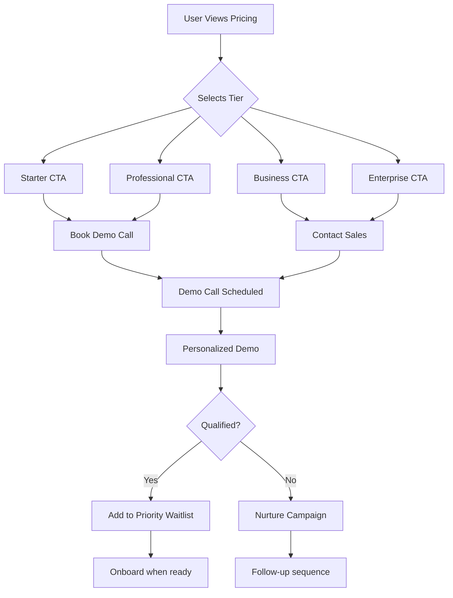

# AI Receptionist - Comprehensive Pricing Blueprint

## Executive Summary

This blueprint provides a full analysis of the AI Receptionist platform and a strategic pricing model designed to maximize conversions while ensuring profitability. All pricing tiers are designed to redirect users to **Demo Call Booking** and **Waitlist Sign-up** pages to qualify leads before activation.

---

## 🎯 Application Analysis

### Core Product Offering

**AI Receptionist** is an enterprise-grade SaaS platform that enables businesses to:
- Automate customer service operations using AI-powered voice and chat
- Book appointments automatically with natural language processing
- Integrate with multiple channels (Voice, WhatsApp, Web Chat)
- Manage multi-tenant businesses with isolated data
- Track analytics and call transcripts in real-time

### Key Value Propositions

1. **24/7 Availability**: Never miss a customer call
2. **Cost Reduction**: Replace human receptionists (avg. $30k-40k/year salary)
3. **Scalability**: Handle unlimited concurrent calls
4. **Integration**: Seamlessly connects with existing business tools
5. **Multi-channel**: Voice, chat, WhatsApp all in one platform

### Target Market Segments

1. **Small Businesses** (1-5 locations)
   - Medical practices, dental clinics
   - Beauty salons, spas
   - Law firms, accounting offices
   - Real estate agencies

2. **Growing Businesses** (5-20 locations)
   - Multi-location healthcare
   - Retail chains
   - Service franchises
   - Hospitality groups

3. **Enterprise** (20+ locations or agencies)
   - Healthcare networks
   - National franchises
   - Marketing agencies managing multiple clients
   - Enterprise corporations

---

## 💰 Cost Structure Analysis

### Vapi.ai Operational Costs (from provided data)

**Cost Breakdown for 3-minute calls with 1000 prompt tokens:**

| Volume | Calls/Month | Vapi Hosting | Transport | LLM | TTS | STT | **Total Cost** |
|--------|-------------|--------------|-----------|-----|-----|-----|----------------|
| Tier 1 | 600 calls   | $63/mo       | $0/mo     | $60/mo | $12/mo | $12/mo | **$147-161/mo** |
| Tier 2 | 1,000 calls | $105/mo      | $0/mo     | $100/mo | $20/mo | $20/mo | **$245-269/mo** |

**Key Cost Components:**
- **Vapi Hosting**: $0.05/min container hosting
- **Transport**: FREE (Vapi Telephony/SIP) or ~$0.008/min (Twilio)
- **LLM**: GPT-4.1 Nano @ $0.01/1M tokens (~$0.10 per call)
- **TTS**: Vapi @ $0.0216/min speech synthesis
- **STT**: Deepgram @ $0.01/min speech recognition

### Additional Platform Costs

- **MongoDB Atlas**: $25-57/mo (M10 shared cluster)
- **Railway/Hosting**: $20-50/mo (backend hosting)
- **Vercel**: $0-20/mo (frontend CDN)
- **Support/Operations**: Variable based on tier

**Total Infrastructure Cost per Tier:**
- 600 calls: ~$210-270/mo
- 1000 calls: ~$320-380/mo

---

## 🎨 Pricing Strategy & Tier Structure

### Design Philosophy

1. **Value-Based Pricing**: Price based on customer ROI, not just costs
2. **Clear Differentiation**: Each tier serves a distinct customer segment
3. **Upgrade Path**: Natural progression as businesses grow
4. **Lead Qualification**: All CTAs direct to demo/waitlist for human touch

### Recommended Pricing Tiers

> [!IMPORTANT]
> **All pricing tiers redirect to Demo Call Booking and Waitlist pages** to ensure proper lead qualification and onboarding.

---

### 🌱 Starter Plan - **$299/month**

**Target**: Small businesses (1-2 locations) testing AI automation

**Positioning**: "Get Started with AI Receptionist"

**Included:**
- ✅ **500 AI calls per month** (~$150 cost)
- ✅ **Basic appointment booking** (automated scheduling)
- ✅ **1 business location**
- ✅ **Email support** (48-hour response)
- ✅ **Standard AI voice** (GPT-4.1 Nano)
- ✅ **WhatsApp integration**
- ✅ **Basic analytics dashboard**
- ✅ **Call transcripts & recordings**

**CTA**: "Book Demo Call" → Qualify lead → Add to waitlist

**Profit Margin**: 40-45% (~$120-140/mo profit)

**ROI Pitch**: *"Replace part-time receptionist ($1,500/mo) → Save $1,200/mo"*

---

### ⚡ Professional Plan - **$699/month** 
**(MOST POPULAR)**

**Target**: Growing businesses (3-10 locations) needing automation

**Positioning**: "Scale Your Business with AI Automation"

**Included:**
- ✅ **1,500 AI calls per month** (~$400-450 cost)
- ✅ **Advanced appointment booking**
- ✅ **Up to 5 business locations**
- ✅ **Priority support 24/7** (4-hour response)
- ✅ **Custom voice cloning** (+$50 cost)
- ✅ **All integrations**:
  - Google Calendar sync
  - HubSpot CRM
  - Slack notifications
  - Airtable logging
  - WhatsApp/SMS confirmations
- ✅ **Advanced analytics & reporting**
- ✅ **API access** (for custom integrations)
- ✅ **Custom business hours & timezone**

**CTA**: "Book Demo Call" → Personalized demo → Priority waitlist

**Profit Margin**: 35-40% (~$250-300/mo profit)

**ROI Pitch**: *"Replace full-time receptionist ($3,000/mo) → Save $2,300/mo"*

---

### 🏢 Business Plan - **$1,499/month**

**Target**: Multi-location businesses (10-25 locations) or agencies

**Positioning**: "Enterprise-Grade AI for Growing Organizations"

**Included:**
- ✅ **5,000 AI calls per month** (~$850-950 cost)
- ✅ **Unlimited appointment booking**
- ✅ **Up to 25 business locations**
- ✅ **Dedicated account manager**
- ✅ **Advanced voice customization**
- ✅ **White-label dashboard** (optional)
- ✅ **Custom automated workflows**
- ✅ **SLA guarantees** (99.9% uptime)
- ✅ **Advanced security & compliance**
- ✅ **Priority phone support** (1-hour response)
- ✅ **Quarterly business reviews**

**CTA**: "Contact Sales" → Enterprise demo → Fast-track onboarding

**Profit Margin**: 35-40% (~$500-600/mo profit)

**ROI Pitch**: *"Manage 25 locations efficiently → Save $50,000+/year in staffing"*

---

### 🚀 Enterprise Plan - **Custom Pricing**

**Target**: Large enterprises (25+ locations), franchises, agencies

**Positioning**: "Fully Customized AI Solutions for Enterprises"

**Included:**
- ✅ **Unlimited AI calls** (custom volume pricing)
- ✅ **Unlimited locations**
- ✅ **Multi-tenant management** (for agencies)
- ✅ **Dedicated infrastructure** (isolated deployment)
- ✅ **Custom integrations** (any API)
- ✅ **White-label solution** (your branding)
- ✅ **24/7 premium support** (dedicated Slack channel)
- ✅ **Custom SLA agreements**
- ✅ **Onboarding & training**
- ✅ **Volume discounts**

**CTA**: "Schedule Enterprise Demo" → Custom proposal → Priority onboarding

**Profit Margin**: 40-50% (negotiated per contract)

**ROI Pitch**: *"Scale to 100+ locations with centralized AI management"*

---

## 📊 Pricing Comparison Matrix

| Feature | Starter | Professional | Business | Enterprise |
|---------|---------|--------------|----------|------------|
| **Price** | $299/mo | $699/mo | $1,499/mo | Custom |
| **Calls/Month** | 500 | 1,500 | 5,000 | Unlimited |
| **Locations** | 1 | 5 | 25 | Unlimited |
| **Support** | Email (48h) | 24/7 Priority | Account Manager | Dedicated Team |
| **Voice** | Standard | Custom Clone | Advanced | Fully Custom |
| **Integrations** | Basic | All Standard | All + Custom | Fully Custom |
| **Analytics** | Basic | Advanced | Enterprise | Custom BI |
| **SLA** | - | - | 99.9% | Custom |
| **Multi-tenant** | ❌ | ❌ | ❌ | ✅ |
| **White-label** | ❌ | ❌ | Optional | ✅ |

---

## 🎯 Conversion Strategy

### Lead Qualification Funnel

All pricing tiers use a **Demo-First Approach**:

### CTA Strategy per Tier

#### Starter & Professional Tiers
- **Primary CTA**: "Book Your Demo Call"
- **Secondary CTA**: "Join Waitlist"
- **Calendar Integration**: Calendly or similar
- **Demo Duration**: 30 minutes
- **Qualification Questions**:
  1. Business type & size
  2. Current call volume
  3. Pain points with current receptionist
  4. Expected ROI timeline
  5. Budget authority

#### Business & Enterprise Tiers
- **Primary CTA**: "Schedule Enterprise Call"
- **Secondary CTA**: "Request Custom Proposal"
- **Sales Call**: 45-60 minutes with sales engineer
- **Qualification Questions**:
  1. Number of locations
  2. Current tech stack
  3. Integration requirements
  4. Decision-making process
  5. Budget & timeline

---

## 🚀 Marketing Positioning

### Key Messages by Tier

#### Starter Tier
**Headline**: "Start Automating Your Front Desk Today"
**Subhead**: "Perfect for small businesses ready to embrace AI"
**Pain Point**: "Tired of missing calls and losing customers?"
**Solution**: "Never miss another call with 24/7 AI receptionist"

#### Professional Tier
**Headline**: "Scale Your Business with AI Automation"
**Subhead**: "Everything you need to grow multi-location operations"
**Pain Point**: "Struggling to manage appointments across locations?"
**Solution**: "Centralized AI system managing all your bookings"

#### Business Tier
**Headline**: "Enterprise-Grade AI for Serious Growth"
**Subhead**: "Built for businesses managing 10-25 locations"
**Pain Point**: "Can't afford to hire receptionists for every location?"
**Solution**: "One AI system handles all locations, 24/7"

#### Enterprise Tier
**Headline**: "Custom AI Solutions for Large Organizations"
**Subhead**: "White-label, multi-tenant, fully customizable"
**Pain Point**: "Need complete control and customization?"
**Solution**: "Fully tailored AI platform with dedicated support"

---

## 💡 Add-ons & Upsells

### Optional Paid Add-ons

1. **Additional Call Volume**
   - +500 calls: $99/mo
   - +1,000 calls: $179/mo
   - +5,000 calls: $699/mo

2. **Premium Voice Cloning**
   - Custom voice training: $299 one-time
   - Celebrity-style voices: $149/mo

3. **Advanced Integrations**
   - Salesforce CRM: $99/mo
   - Custom API integration: $299/mo
   - Zapier premium: $49/mo

4. **Additional Locations**
   - +1 location: $49/mo
   - +5 locations: $199/mo
   - +10 locations: $349/mo

5. **Dedicated Phone Number**
   - Local number: $10/mo
   - Toll-free: $20/mo
   - International: $30/mo

---

## 📈 Revenue Projections

### Conservative Growth Model (Year 1)

| Month | Starter (10) | Pro (5) | Business (2) | Enterprise (1) | **MRR** | **ARR** |
|-------|--------------|---------|--------------|----------------|---------|---------|
| Mo 1-3 | $2,990 | $3,495 | $2,998 | $3,000 | **$12,483** | $149,796 |
| Mo 4-6 | $5,980 | $6,990 | $5,996 | $6,000 | **$24,966** | $299,592 |
| Mo 7-9 | $8,970 | $10,485 | $8,994 | $9,000 | **$37,449** | $449,388 |
| Mo 10-12 | $11,960 | $13,980 | $11,992 | $12,000 | **$49,932** | $599,184 |

**Year 1 Target**: $599K ARR with 68 customers

### Target Customer Mix (Steady State)
- 40% Starter ($299)
- 35% Professional ($699)
- 20% Business ($1,499)
- 5% Enterprise (avg $3,000)

---

## 🎨 Design & UX Recommendations

### Pricing Page Structure

1. **Hero Section**
   - Headline: "Pricing That Scales With Your Business"
   - Subhead: "Start with a personalized demo. No credit card required."
   - Social proof: "Join 500+ businesses automating their front desk"

2. **Pricing Cards**
   - 4 tiers side-by-side (responsive on mobile)
   - Clear differentiation with "Most Popular" badge on Professional
   - Gradient backgrounds matching brand
   - Animated on hover

3. **Comparison Table**
   - Detailed feature matrix
   - Toggle between Monthly/Annual view
   - Highlight differences between tiers

4. **ROI Calculator** (Interactive)
   - Input: Current receptionist cost
   - Input: Average calls per day
   - Output: Estimated savings per year

5. **Social Proof**
   - Customer testimonials
   - Case studies with ROI metrics
   - Trust badges (SOC 2, GDPR, etc.)

6. **FAQ Section**
   - "How is this priced?"
   - "What happens if I exceed my call limit?"
   - "Can I switch plans?"
   - "Do you offer refunds?"

7. **Final CTA**
   - "Ready to automate your front desk?"
   - Two buttons: "Book Demo" | "Join Waitlist"

---

## 🔍 Competitive Analysis

### Market Positioning

| Competitor | Starting Price | Our Advantage |
|------------|----------------|---------------|
| **Answering Service** | $1.50/call (~$750/mo for 500 calls) | We're 60% cheaper with automation |
| **Human Receptionist** | $2,500-3,500/mo (full-time) | We're 90% cheaper, 24/7 available |
| **Generic AI Chatbot** | $99-299/mo | We're voice-first with phone integration |
| **Vapi Direct** | Pay-as-you-go | We provide full platform + support |

**Unique Value**: We're the only **fully integrated, multi-tenant, enterprise-ready AI receptionist platform** with voice, chat, and WhatsApp in one solution.

---

## ✅ Success Metrics & KPIs

### Conversion Tracking

1. **Pricing Page Metrics**
   - Page views: Target 10,000/mo
   - Bounce rate: <40%
   - Time on page: >2 minutes
   - Scroll depth: >75%

2. **CTA Performance**
   - Demo bookings: 5% conversion rate
   - Waitlist signups: 10% conversion rate
   - Total leads: 1,500/mo

3. **Demo-to-Customer**
   - Demo show rate: 70%
   - Demo-to-trial: 40%
   - Trial-to-paid: 60%
   - **Overall conversion**: 16.8%

4. **Customer Metrics**
   - CAC (Customer Acquisition Cost): <$500
   - LTV (Lifetime Value): $12,000+ (avg 18-month retention)
   - LTV:CAC ratio: >24:1
   - Churn rate: <5%/month

---

## 🛠️ Implementation Checklist

### Phase 1: Page Creation (Week 1)
- [ ] Design pricing page UI/UX
- [ ] Implement responsive pricing cards
- [ ] Add comparison table
- [ ] Create ROI calculator widget
- [ ] Set up demo booking integration (Calendly)
- [ ] Create waitlist form with database

### Phase 2: CTA Integration (Week 2)
- [ ] Connect "Book Demo" to Calendly
- [ ] Build waitlist signup API endpoint
- [ ] Email automation for demo confirmations
- [ ] Slack notifications for new leads
- [ ] CRM integration (HubSpot/Salesforce)

### Phase 3: Analytics & Optimization (Week 3)
- [ ] Google Analytics event tracking
- [ ] Hotjar heatmaps
- [ ] A/B testing framework
- [ ] Conversion pixel tracking
- [ ] Lead scoring system

### Phase 4: Launch & Marketing (Week 4)
- [ ] SEO optimization
- [ ] Social sharing setup
- [ ] Email campaign to existing users
- [ ] Blog post announcing pricing
- [ ] Partner/affiliate program launch

---

## 📋 Next Steps

> [!NOTE]
> **Immediate Actions Required**
> 
> 1. **Review & Approve** this pricing blueprint
> 2. **Provide Feedback** on pricing tiers and positioning
> 3. **Clarify** demo call process and waitlist management
> 4. **Confirm** integration preferences (Calendly, HubSpot, etc.)
> 
> Once approved, I'll proceed to build the pricing page with all components.

---

## Questions for Review

1. **Pricing Levels**: Do these price points align with your target market research?
2. **Feature Distribution**: Should any features be moved between tiers?
3. **Demo Process**: What's your preferred tool for demo scheduling?
4. **Waitlist Management**: How should we prioritize waitlist members?
5. **Payment Processing**: Should we integrate Stripe for future direct billing?
6. **Trial Period**: Should we offer free trials after demos?

---

**Document Version**: 1.0  
**Created**: December 26, 2025  
**Status**: Pending Review
